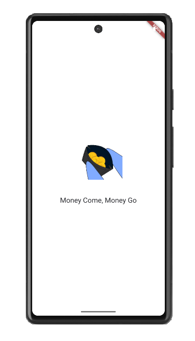
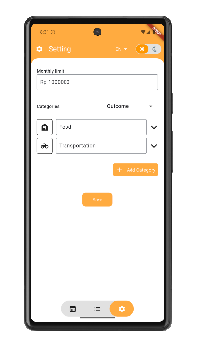
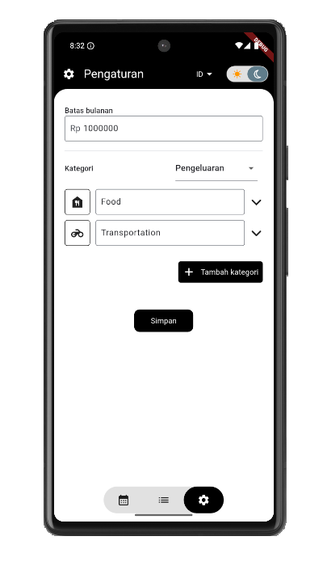

# My Budget

A financial notes app, write all our daily transaction, both income or outcome, and see it report based on type and date range.

There are several libraries used in this app, like: 

<table>
  <thead>
    <tr>
      <th>Library</th>
      <th>Description</th>
    </tr>
    <tr>
      <td>flutter_bloc</td>
      <td>State management</td>
    </tr>
    <tr>
      <td>drift</td>
      <td>Access SQLite</td>
    </tr>
    <tr>
      <td>get_it</td>
      <td>Dependency Injection</td>
    </tr>
    <tr>
      <td>pie_chart</td>
      <td>Show statistics in pie chart</td>
    </tr>
    <tr>
      <td>easy_localization</td>
      <td>Handling multi languages</td>
    </tr>
    <tr>
      <td colspan="2">and more (see pubspec.yaml)</td>
    </tr>
  </thead>
</table>

These are several screens and it explanation:

<ul>
  <li>
    <b>Splash</b>
    
Show splash screen for 2 seconds, then go to dashboard screen.

    
  </li>
  <li>
    <b>Daily Transaction</b>
    
Show income/outcome transaction based on date filter.

    
  </li>
  <li>
    <b>Add Transaction</b>
    
Create new transaction

    
  </li>
  <li>
    <b>Dashboard</b>
    
There are 3 main features here: home, news, and profile. User can go to each page using bottom navigation.

    
  </li>
  <li>
    <b>Schedule</b>
    
Show schedules of each days and their details.

    
  </li>
  <li>
    <b>Transcript</b>
    
Show transcript report of previous semester.

    
  </li>
  <li>
    <b>Progress</b>
    
Show progress report of this semester. See attendance, scores (home work, mid/end test, etc), up to estimating final score.

    
  </li>
</ul>